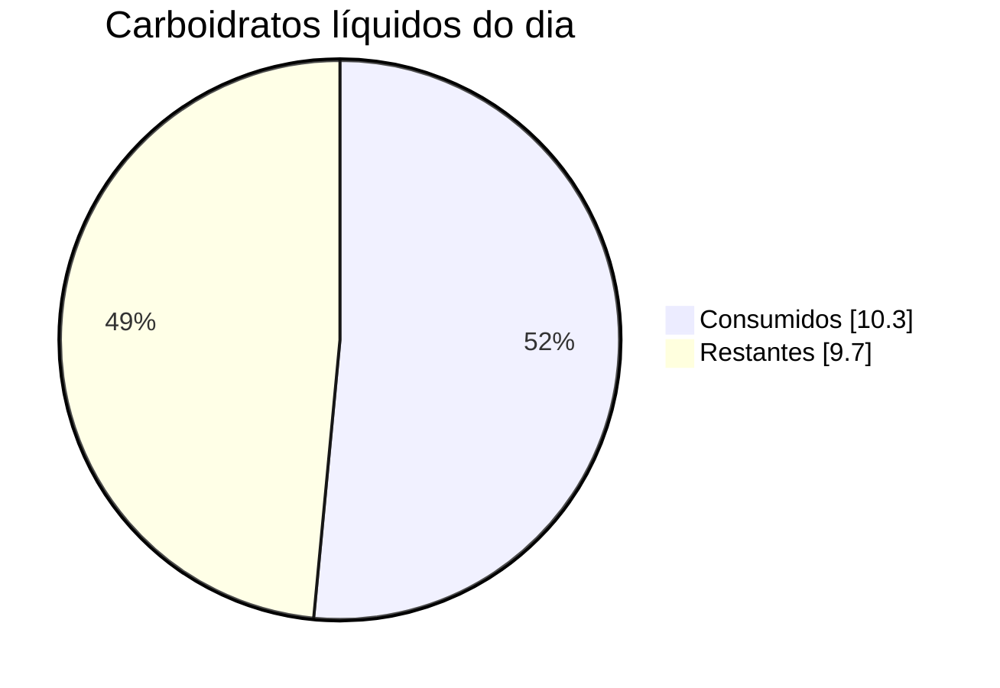

# Painel cetogênico

Acompanhamento diário de carboidratos líquidos e outros nutrientes.

## Resumo de hoje — 11/07/2026

| Indicador | Valor |
|---|---:|
| Meta de carboidratos líquidos | 20,0 g |
| Consumido | **10,3 g** |
| Restante | **9,7 g** |
| Calorias | 41 kcal |
| Proteínas | 0,0 g |
| Gorduras | 0,0 g |

## Registro alimentar

| Horário | Alimento | Quantidade | Carb. líquidos | Calorias |
|---|---|---:|---:|---:|
| 11:01 | Água de coco natural | 200 ml | 10,3 g | 41 kcal |

O site está na pasta `docs/`. Os dados ficam em `docs/data.json` e poderão ser atualizados conforme novos alimentos forem registrados.

> Estimativas nutricionais não substituem avaliação médica ou nutricional. A meta de 20 g é apenas uma referência inicial e pode ser ajustada.